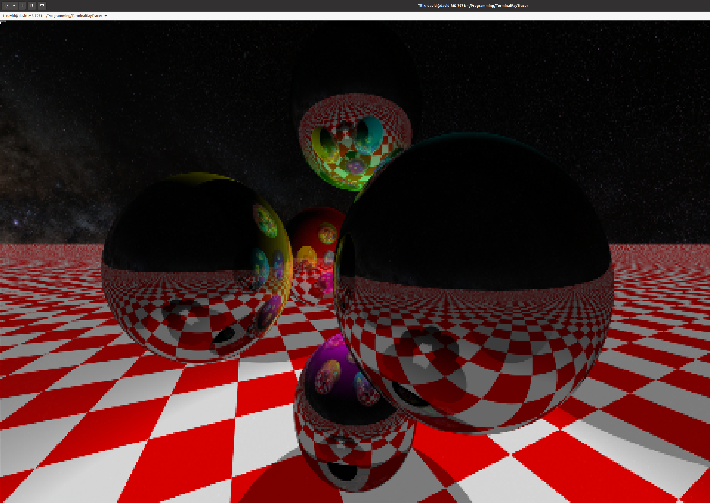

# Terminal Ray Tracer
A ray tracer that runs in the terminal with no dependencies



## how to use

```
clang TerminalRayTracer.c -lm -O3 && ./a.out
```

## To Do
 1. ~~actual ray tracing~~
 1. ~~floor~~
 1. ~~lighting~~ 
 1. ~~sky box texture~~
 1. convert to CUDA to run on GPU
 1. camera controls from keyboard input
 1. ~~materials~~
 1. other shapes
 1. GJK based collision physics